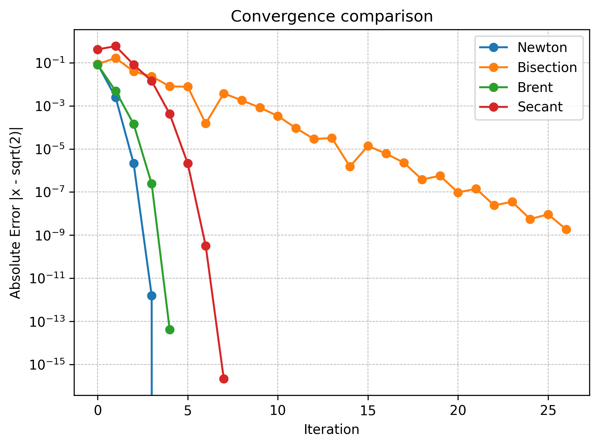

# Numerical Root Finder


A small Python library implementing classical numerical methods for solving nonlinear equations:  

<p align="center" style="font-size: 1.1em;"><b>f</b>(<i>x</i>) = 0</p>

Part of the **SKmodels** portfolio focused on scientific computing, numerical analysis and algorithm design.
---
## Implemented Methods
- **Newton-Raphson** (1D) - Quadratic convergence (order 2)
- **Bisection** - Guaranteed convergence (linear order 1)
- **Secant** - Superlinear convergence (~1.618)
- **Brent's Method** - Hybrid bracketing + Interpolation (robust and fast)
- **Multidimensional Newton Systems** 
- **Optional Analytic or Finite-difference Jacobians**
- **Backtracking Line search**
- **Convergence Tracking**

## Convergence Properties
- Newton - Derivative-based - Quadratics (p ~ 2)  
- Bisection - Bracketing (Robust) - Linear (p ~ 1)  
- Secant - Derivative-free - Superlinear (p ~ 1.618)  
- Brent's - Bracketing (robust) + inverse quadratic interpolation/secant (fast), with bisection fallback to guarantee convergence

### Definition of Convergence Order

The order of convergence \(p\) is defined by:

<p align="center">
  <b>p</b> = lim<sub>n → ∞</sub>
  log(e<sub>n+1</sub> / e<sub>n</sub>) /
  log(e<sub>n</sub> / e<sub>n−1</sub>)
</p>

where

<p align="center">
  e<sub>n</sub> = |x<sub>n</sub> − r|
</p>

## Installation 
### Repository
```bash
git clone https://github.com/SKmodels/numerical-root-finder.git
cd numerical-root-finder
```
### Install runtime dependencies 
```bash
pip install -r requirements.txt
```
### Install development dependencies
```bash
pip install -r requirements-dev.txt 
```

## Example usage

To run each method;

```bash
python -m examples.[name]_usage
```
### Newton-Raphson method

```python 
from methods.newton import newton_method

f = lambda x: x**2 - 2
df = lambda x: 2*x

result = newton_method(f, df, x0=1.5)

print("Root:", result.root)
print("Converged:", result.converged)
```
### Multidimensional Newton System

```python
import numpy as np
from methods.solver import solve_system

def F(v):
    x, y = v
    return np.array([
        x**2 + y**2 - 1.0,
        x - y
    ])

def J(v):
    x, y = v
    return np.array([
        [2*x, 2*y],
        [1.0, -1.0]
    ])

res = solve_system(
    method="newton",
    F=F,
    x0=[0.8, 0.6],
    jac=J
)

print("Root:", res.root)
print("Converged:", res.converged)
```
### Bisection method

```python
from methods.bisection import bisection_method

f = lambda x: x**2 - 2

result = bisection_method(f, a=1.0, b=2.0)

print("Root:", result.root)
print("Converged:", result.converged)
```
### Secant method
```python
from methods.secant import secant_method

f = lambda x: x**2 - 2

result = secant_method(f, x0=1.0, x1=2.0)

print("Root:", result.root)
print("Iterations:", result.iterations)
print("Converged:", result.converged)
```
### Brent's method
```python
from methods.brent import brent_method

f = lambda x: x**2 - 2

result = brent_method(f, a=1.0, b=2.0)

print("Root:", result.root)
print("Iterations:", result.iterations)
print("Converged:", result.converged)
```
### Convergence plot
```python
import math
import matplotlib.pyplot as plt
from pathlib import Path

from methods.bisection import bisection_method
from methods.newton import newton_method
from methods.brent import brent_method
from methods.secant import secant_method
true_root = math.sqrt(2)

f = lambda x: x**2 - 2
df = lambda x: 2 * x

newton = newton_method(f, df, x0=1.5)
bisect = bisection_method(f, a=1.0, b=2.0)
brent = brent_method(f, a=1.0, b=2.0)
secant = secant_method(f, x0=1.0, x1=2.0)

newton_err = [abs(x - true_root) for x in newton.history]
bisect_err = [abs(x - true_root) for x in bisect.history]
brent_err = [abs(x - true_root) for x in brent.history]
secant_err = [abs(x - true_root) for x in secant.history]

plt.figure()
plt.semilogy(newton_err, marker="o", label="Newton")
plt.semilogy(bisect_err, marker="o", label="Bisection")
plt.semilogy(brent_err, marker="o", label="Brent")
plt.semilogy(secant_err, marker="o", label="Secant")

plt.xlabel("Iteration")
plt.ylabel("Absolute Error |x - sqrt(2)|")
plt.title("Convergence Comparison")
plt.legend()
plt.grid(True, which="both", linestyle="--", linewidth=0.5)
plt.tight_layout()

project_root = Path(__file__).resolve().parents[1]
docs_path = project_root / "docs"
docs_path.mkdir(exist_ok=True)

out_file = docs_path / "convergence.png"
plt.savefig(out_file, dpi=300, bbox_inches="tight")
plt.show()
```
## Convergence Comparison

Run the comparison

```bash
python -m examples.plot_convergence
```

Example convergence behaviour for solving:

<p align="center" style="font-size: 1.1em;"><i>x</i><sup>2</sup> − 2 = 0</p>



*Absolte error vs iteration (log scale).*

- Newton - faster near the root (quadratic) however, requires a derivative & a decent initial guess.
- Bisection - guaranteed convergence when the root is bracketed, but slower (linear).
- Secant - derivative-free & usually faster than bisection (superlinear), but not guaranteed convergence.
- Brent's method - achieves near-Newton speed while retaining bisection robustness.

## Performance Benchmark
 
Run the benchmark

```bash
python -m examples.benchmark_methods
``` 
Example solving \( x^2 - 2 = 0 \)

| Method     | Iterations | Final Error   | Time (s)  |
|------------|------------|---------------|-----------|
| Newton     | 4          | 0.00e+00      | 0.000014  |
| Secant     | 6          | 2.22e-16      | 0.000007  |
| Bisection  | 27         | 1.85e-09      | 0.000012  |
| Brent      | 5          | 4.17e-14      | 0.000028  |
  

## Unified Solver Interface

- The solve() function provides a unified interface:

```python
from methods.solver import solve

result = solve(
  method="secant",
  f=lambda x: x**2 - 2,
  x0=1.0
  x1=2.0
)
```
### Using solve() for Multidimensional Newton Systems
```python
The solver computes updates by solving:

    J(x_k) Δx_k = -F(x_k)

and updates:

    x_{k+1} = x_k + α Δx_k

where α is determined by an Armijo-style backtracking line search.
```

## Testing & CI

All methods are validated using:

- Analytical convergence order estimation
- Bracket shrink guarantees (bisection)
- Known closed-form roots (sqrt(2) example)
- Continuous integration via GitHub Actions

### Run test locally
```bash
pytest
```
## Design Philosophy 

- All solvers retur structures result objects containing: 
  - 'root'
  - 'converged'
  - 'iterations' - which is stored for convergence analysis
  - 'history' of approximations
- Convergence behaviour can be analysed programmatically 
- Unified solver interface ('solve()') supports multiple algorithms and explicitly implemented (with SciPy dependency)
- CI-tested using 'pytest' and GitHub Actions
- Emphasis on numerical stability and theoretical correctness

## Why This Project?

Root-finding is a foundational problem in scientific computing, numerical analysis, optimisation and machine learning.

This project was built as part of the SKmodels portfolio to develop a deeper understanding of numerical stability, convergence theory and algorithmic design. 